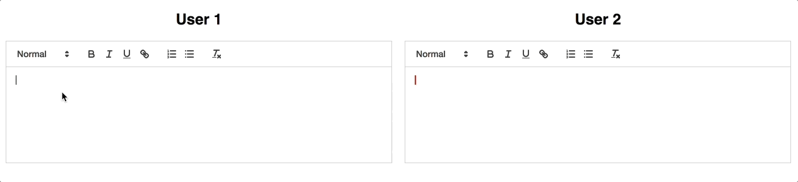

[](https://npmjs.org/package/quill-cursors)
[](https://travis-ci.com/reedsy/quill-cursors)

# quill-cursors

A collaborative editing module for the [Quill](https://github.com/quilljs/quill) text editor used by the
[Reedsy](https://reedsy.com) team.



## Install

```bash
npm install quill-cursors --save
```

## Usage

`quill-cursors` is a Quill module that exposes a number of methods to help display other users' cursors for
collaborative editing.

First, [set up a Quill editor](https://quilljs.com/docs/quickstart/).

Next, load `quill-cursors` through any of the options presented by [UMD](https://github.com/umdjs/umd).

Load script in HTML:

```html
<script src="quill-cursors.js"></script>
```

Using [ES6-style `import`](https://developer.mozilla.org/en-US/docs/Web/JavaScript/Reference/Statements/import):

```javascript
import QuillCursors from 'quill-cursors';
```

Using CommonJS-style `require`:

```javascript
const QuillCursors = require('quill-cursors');
```

Then, register the `quill-cursors` module:

```javascript
Quill.register('modules/cursors', QuillCursors);

const quill = new Quill('#editor', {
  modules: {
    cursors: true,
  }
});
```

Finally, use the exposed `quill-cursors` methods to update the cursors (see below). For an example setup, see the
[example code](example), which can be run with:

```bash
npm start
```

## API

### Configuration

The `quill-cursors` module has the following optional configuration:

  - `template` _string_: override the default HTML template used for a cursor
  - `containerClass` _string_ (default: `ql-cursors`): the CSS class to add to the cursors container
  - `hideDelayMs`: _number_ (default: `3000`): number of milliseconds to show the username flag before hiding it
  - `hideSpeedMs`: _number_ (default: `400`): the duration of the flag hiding animation in milliseconds
  - `selectionChangeSource` _string_ | _null_ (default: `api`): the event source to use when emitting `selection-change`
  - `transformOnTextChange`: _boolean_ (default: `false`): attempt to locally infer cursor positions whenever the editor
    contents change, without receiving an update from the other client. This can be useful for smoother performance on
    high-latency connections.

Provide these options when setting up the Quill editor:

```javascript
const editor = new Quill('#editor', {
  modules: {
    cursors: {
      template: '<div class="custom-cursor">...</div>',
      hideDelayMs: 5000,
      hideSpeedMs: 0,
      selectionChangeSource: null,
      transformOnTextChange: true,
    },
  },
});
```

#### `template`

For the custom template to work correctly with the module, it should closely follow the classes in the
[original template](src/quill-cursors/template.ts).

#### `selectionChangeSource`

By default, QuillJS will [suppress `selection-change` events when typing](https://quilljs.com/docs/api/#selection-change)
to avoid noise.

However, you will probably want to update the `quill-cursors` selection on both `selection-change` and `text-change`.
In order to aid this, `quill-cursors` will automatically emit a `selection-change` event on `text-change`.

You can differentiate between user input and the `quill-cursors` module by checking the `source` argument for the
`selection-change` event. By default, `quill-cursors` will have `source = 'api'`, but if you need to differentiate
between calls from `quill-cursors` and other events, then you can change this `source` using the `selectionChangeSource`
option.

If emitting an event is undesirable (eg you want `selection-change` to act like the Quill default), then the
`selectionChangeSource` can be set to `null`, and an event will not be emitted. Note that in this case, you will need to
separately handle the `text-change` event and update the cursor position.

### Methods

The module instance can be retrieved through Quill's [`getModule`](https://quilljs.com/docs/api/#getmodule):

```javascript
const cursors = editor.getModule('cursors');
```

#### `createCursor`

```typescript
createCursor(id: string, name: string, color: string): Cursor;
```

Creates a `Cursor` instance with the given `id`. If a cursor with this `id` already exists, a new one is not created.

- `id` _string_: the unique ID for the cursor
- `name` _string_: the name to display on the cursor
- `color` _string_: the [CSS color](https://developer.mozilla.org/en-US/docs/Web/CSS/color_value) to use for the cursor

Returns a `Cursor` object:

```typescript
{
  id: string;
  name: string;
  color: string;
  range: Range; // See https://quilljs.com/docs/api/#selection-change
}
```

#### `moveCursor`

```typescript
moveCursor(id: string, range: QuillRange): void;
```

Sets the selection range of the cursor with the given `id`.

- `id` _string_: the ID of the cursor to move
- `range` [_Range_](https://quilljs.com/docs/api/#selection-change): the selection range

#### `removeCursor`

```typescript
removeCursor(id: string): void;
```

Removes the cursor with the given `id` from the DOM.

- `id` _string_: the ID of the cursor to remove

#### `update`

```typescript
update(): void;
```

Redraws all of the cursors in the DOM.

#### `clearCursors`

```typescript
clearCursors(): void;
```

Removes all the cursors from the DOM.

#### `toggleFlag`

```typescript
toggleFlag(id: string, shouldShow?: boolean): void;
```

Toggles display of the flag for the cursor with the given `id`.

- `id` _string_: the ID of the cursor whose flag should be toggled
- `shouldShow` _boolean_ (optional): if set to `true`, will display the flag. If set to `false`, will hide it. If omitted, the flag's display state will be toggled.

#### `cursors`

```typescript
cursors(): Cursor[];
```

Returns an array of all the `Cursor` objects in the DOM in no particular order.

## License

This code is available under the [MIT license](LICENSE-MIT.txt).
